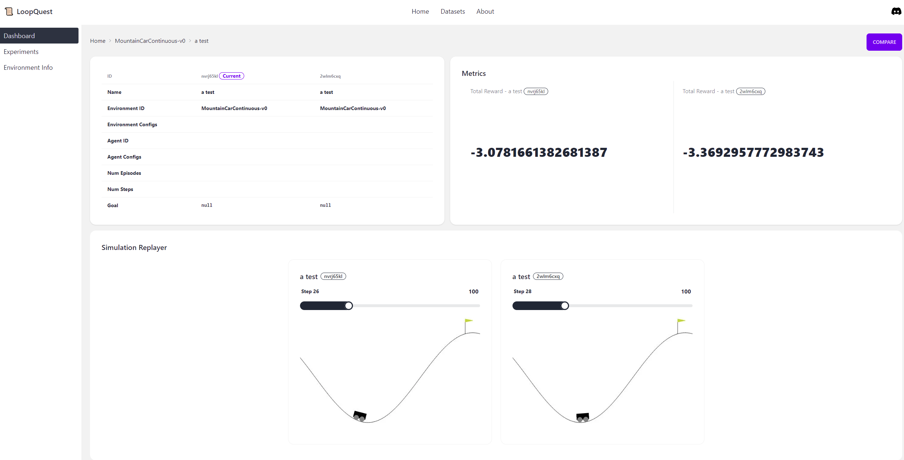

# :scroll:Loopquest

A Production Tool for Embodied AI.


- :video_camera:[Tutorial Video](https://capture.dropbox.com/Nucp9ObLT63qDr2E)
- :house:[Discord](https://discord.gg/FTnFYeSy9r)

# Major features

- Log all the observation, action, reward, rendered images into database with only ONE extra line of code.

```python
env = gymnasium.make("MountainCarContinuous-v0", render_mode="rgb_array")
```

->

```python
env = LoopquestGymWrapper(
    gymnasium.make("MountainCarContinuous-v0", render_mode="rgb_array")
)
```

- Beautiful frontend to visualize all the data and rendered images / videos of the simulation environment.
- Compare your experiments in an intuitive way.
- Directly trainable data for robotics foundation model. Select and download the (observation, action, reward) data with the dataloader interfaces of the most popular deep learning frameworks (e.g. tensorflow, pytorch, huggingface dataset apis).

# Installation

For stable version, run

```
pip install loopquest
```

For dev version or loopquest project contributors, clone the git to your local machine by running

```
git clone https://github.com/LoopMind-AI/loopquest.git
```

Change to the project root folder and install the package

```
cd loopquest
pip install -e .
```

# How to run (dev only for now)

At `loopquest` folder, bring up web-app,

```
docker compose up --build
```

Then run quickstart script,

```
python examples/quickstart.py
```

The command prompt should mention "Check your experiment progress on `http://localhost:5667/experiment/<exp_id>`".

# Quick Start Example

```python
import gymnasium
from loopquest.gym_wrappers import LoopquestGymWrapper

experiment_name = "test"
env = LoopquestGymWrapper(
    gymnasium.make("MountainCarContinuous-v0", render_mode="rgb_array"),
    experiment_name,
)
obs, info = env.reset()
for i in range(100):
    action = env.action_space.sample()
    obs, reward, terminated, truncated, info = env.step(action)
    rgb_array = env.render()
    if terminated or truncated:
        break
env.close()
```
