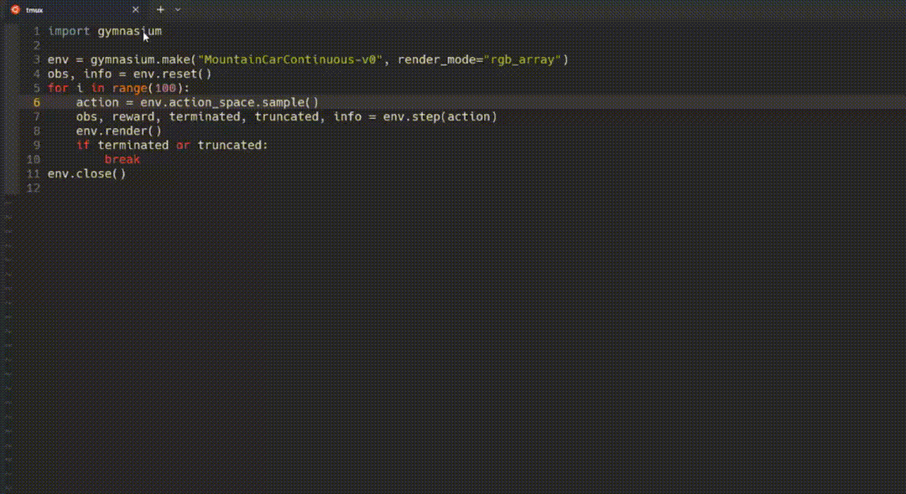

# :scroll:Loopquest

A Production Tool for Embodied AI.


- :video_camera:[Quickstart Demo](https://capture.dropbox.com/embed/CpS8Y4g21ClHlief), [Dataset Demo](https://capture.dropbox.com/AOF5rGxHWyRb9T58)
- :house:[Discord](https://discord.gg/FTnFYeSy9r)

# Major features

- Imitation Learning / Offline Reinforcement Learning Oriented MLOps. Log all the observation, action, reward, rendered images into database with only ONE extra line of code.

```python
env = gymnasium.make("MountainCarContinuous-v0", render_mode="rgb_array")
```

->

```python
import loopquest
loopquest.init()
env = loopquest.make_env(
    "MountainCarContinuous-v0", render_mode="rgb_array")
)
```

- You can also evaluate the local policy or the policy saved in Huggingface directly by specifying number of episodes and number of steps for each episode.

Local Policy evaluation:

```python
import loopquest
from loopquest.eval import evaluate_local_policy
from loopquest.policy.base import BasePolicy

class RandomPolicy(BasePolicy):
    def __init__(self, action_space):
        self.action_space = action_space

    def compute_action(self, observation):
        return self.action_space.sample()


policy = RandomPolicy(env.action_space)

evaluate_local_policy(
    policy,
    [
        "FetchPickAndPlace-v2",
        "FetchPushDense-v2",
        "FetchReachDense-v2",
        "FetchSlideDense-v2",
    ],
    num_episodes=1,
    num_steps_per_episode=100,
    project_name="test_robotics",
)
```

Remote Policy evaluation:

```python
import loopquest
from loopquest.eval import evaluate_local_policy, evaluate_remote_policy

loopquest.init()

# Cloud evaluation example
evaluate_remote_policy(
    "jxx123/ppo-LunarLander-v2",
    "ppo-LunarLander-v2.zip",
    "PPO",
    ["LunarLander-v2"],
    num_episodes=1,
    num_steps_per_episode=100,
    project_name="test_lunar_remote",
    experiment_configs={"foo": [1, 2, 3], "bar": "hah", "bar": 1.1},
)

```

- Directly trainable data for robotics foundation model. Select and download the (observation, action, reward) data with the dataloader interfaces of the most popular deep learning frameworks (e.g. tensorflow, pytorch, huggingface dataset apis). Check [Dataset Quickstart Example](examples/Dataset%20Quickstart.ipynb) for more details.

```python
from loopquest.datasets import load_dataset, load_datasets
# Load data from a single experiment
ds = load_dataset("your_experiment_id")

# Load data from multiple experiments
ds = load_datasets(["exp1", "exp2"])
```

The data schema will look like

```python
{
    'id': '34yixvic-0-1',
    'creation_time': '2023-09-03T20:53:30.603',
    'update_time': '2023-09-03T20:53:30.965',
    'experiment_id': '34yixvic',
    'episode': 0,
    'step': 1,
    'observation': [-0.55, 0.00],
    'action': [0.14],
    'reward': -0.00,
    'prev_observation': [-0.55, 0.00],
    'termnated': False,
    'truncated': False,
    'done': False,
    'info': '{}',
    'sub_goal': None,
    'image_urls': ['http://localhost:5667/api/step/34yixvic-0-1/image/0'],
    'images': [<PIL.JpegImagePlugin.JpegImageFile image mode=RGB size=600x400 at 0x7F8D33094450>]
}
```

- All the regular MLOps features are included, e.g. data visualization, simulation rendering, experiment management.

# Installation

For stable version, run

```
pip install loopquest
```

For dev version or loopquest project contributors, clone the git to your local machine by running

```
git clone https://github.com/LoopMind-AI/loopquest.git
```

Change to the project root folder and install the package

```
cd loopquest
pip install -e .
```

# Quick Start Examples

## Run Local or Remote Eval

Run [examples/run_local_eval.py](examples/run_local_eval.py).

```python
import loopquest
from loopquest.eval import evaluate_local_policy
from loopquest.policy.base import BasePolicy
import gymnasium as gym


class RandomPolicy(BasePolicy):
    def __init__(self, action_space):
        self.action_space = action_space

    def compute_action(self, observation):
        return self.action_space.sample()


# Create this env just to get the action space.
env = gym.make("FetchPickAndPlace-v2")
policy = RandomPolicy(env.action_space)

loopquest.init()
evaluate_local_policy(
    policy,
    [
        "FetchPickAndPlace-v2",
        "FetchPushDense-v2",
        "FetchReachDense-v2",
        "FetchSlideDense-v2",
    ],
    num_episodes=1,
    num_steps_per_episode=100,
    project_name="test_robotics_new",
)
```

Run [examples/run_remote_eval.py](examples/run_remote_eval.py).

```python
import loopquest
from loopquest.eval import evaluate_remote_policy


loopquest.init()
evaluate_remote_policy(
    "jxx123/ppo-LunarLander-v2",
    "ppo-LunarLander-v2.zip",
    "PPO",
    ["LunarLander-v2"],
    num_episodes=1,
    num_steps_per_episode=100,
    project_name="test_lunar_remote",
    experiment_configs={"foo": [1, 2, 3], "bar": "hah", "bar": 1.1},
)
```

## Env Wrapper Example

Run [examples/run_env_wrapper.py](examples/run_env_wrapper.py).

```python
import loopquest

loopquest.init()
env = loopquest.make_env("MountainCarContinuous-v0", render_mode="rgb_array")
obs, info = env.reset()
for i in range(100):
    action = env.action_space.sample()
    obs, reward, terminated, truncated, info = env.step(action)
    rgb_array = env.render()
    if terminated or truncated:
        break
env.close()
```
